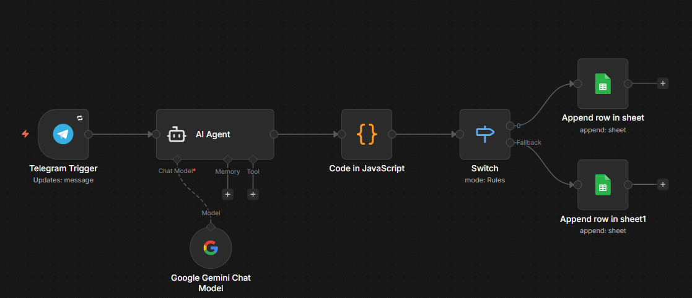

# automatizacion-asistencia
Automatización de registros de asistencia con n8n, Gemini y Google Sheets

## ¿Qué problema resuelve?
Carga manual de planillas de asistencia de empleados, proceso repetitivo y propenso a errores

## ¿Cómo funciona?
1. Le envío captura de las planillas a un BOT de telegram
2. Gemini procesa la imagen y extrae la información
3. n8n resuelve el flujo completo
4. Los datos se vuelcan automáticamente en Google Sheets

## Resultado
- 100% de carga manual eliminada
- Revisión mínima del output generado

## Stack
- n8n (automatización)
- Google Gemini API (procesamiento de imágenes)
- Google Sheets (almacenamiento)
- Telegram (interfaz de entrada)

